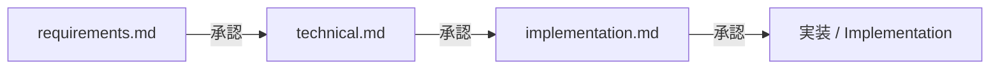

# 仕様書ディレクトリ | Specs Directory

**日本語:** このディレクトリは開発憲法 I（仕様駆動開発）に従い、すべての機能・業務ルール変更の仕様書を格納します。実装前に **人間の承認** が必要です。

**English:** This directory holds specs for every feature and business-rule change per Constitution Principle I. **Human approval** is required before implementation.

---

## ディレクトリ命名 | Directory Naming

```
specs/[ID]-[feature-name]/
├── requirements.md      # 何を作るか / What to build
├── technical.md         # どう作るか / How to build
└── implementation.md    # どう進めるか / How to execute
```

| 要素 / Element | 規則 / Rule |
|----------------|-------------|
| **ID** | GitHub Issue 番号をゼロ埋め 3 桁（例: `001`, `042`） |
| **feature-name** | 英小文字・ハイフン区切り（例: `approval-workflow-reorder`） |
| **例 / Example** | `specs/001-approval-workflow-reorder/` |

---

## 3 段階承認ゲート | Three-Stage Approval Gates



1. **requirements.md** — 業務要件・受け入れ条件・スコープ外
2. **technical.md** — アーキテクチャ・DB・API・RLS・テスト方針
3. **implementation.md** — タスク分解・ブランチ・RED→GREEN 順序

各段階で承認を得てから次へ進むこと。**実装と仕様書の同時作成は禁止**（憲法 VII）。

**English:** Approve each stage before proceeding. Do not implement while writing the spec.

---

## テンプレート | Template

新規仕様書は [`000-template/`](./000-template/) をコピーして開始してください。

**English:** Copy [`000-template/`](./000-template/) to start a new spec.

---

## 既存コードの遡及仕様 | Retroactive Specs for Legacy Code

**日本語:** 憲法採用前に実装済みの機能は、GitHub Issue を起票し、**現行挙動のベースライン仕様**として `specs/` に文書化できます。これは「実装しながら spec を書く」ではなく、承認済みベースラインの記録です。

**English:** Pre-constitution features may be documented as approved baseline specs via GitHub Issues — recording current behavior, not spec-while-coding.

### ベースライン仕様（2026-06-26）| Baseline specs (2026-06-26)

| ID | GitHub | ドメイン / Domain | パス / Path |
|----|--------|-------------------|-------------|
| 001 | [#1](https://github.com/zevaFdo/Ssp_Attendence/issues/1) | 認証・セッション / Auth | [`001-baseline-auth/`](./001-baseline-auth/) |
| 002 | [#2](https://github.com/zevaFdo/Ssp_Attendence/issues/2) | 勤怠・ステータスボード / Attendance | [`002-baseline-attendance/`](./002-baseline-attendance/) |
| 003 | [#3](https://github.com/zevaFdo/Ssp_Attendence/issues/3) | 申請 / Requests | [`003-baseline-requests/`](./003-baseline-requests/) |
| 004 | [#4](https://github.com/zevaFdo/Ssp_Attendence/issues/4) | 承認・PDF・Teams / Approvals | [`004-baseline-approvals/`](./004-baseline-approvals/) |
| 005 | [#5](https://github.com/zevaFdo/Ssp_Attendence/issues/5) | 通知 / Notifications | [`005-baseline-notifications/`](./005-baseline-notifications/) |
| 006 | [#6](https://github.com/zevaFdo/Ssp_Attendence/issues/6) | 管理・招待 / Admin | [`006-baseline-admin/`](./006-baseline-admin/) |

Issue 起票手順: [`docs/onboarding/02-baseline-issues.md`](../docs/onboarding/02-baseline-issues.md)

**English:** See onboarding guide for creating GitHub Issues and linking issue numbers in each spec.

---

## 関連 | Related

- 正本憲法: [`memory/constitution.md`](../memory/constitution.md)
- エッセンス: [`docs/onboarding/01-constitution-essence.md`](../docs/onboarding/01-constitution-essence.md)
- ワークフロー: [`.cursorrules`](../.cursorrules)
